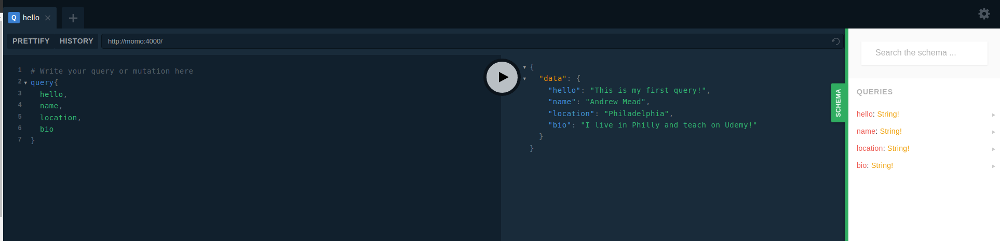

# Commands

## install nodejs

```bash
sudo snap install node --classic --channel 8/stable
node -v
```

# Course 

## GraphQL Basic

```bash
cd graphql-basics

#this code is for src1
npm init
npm install babel-cli@6.26.0 babel-preset-env@1.7.0
npm run start

#this code is for graphql
npm i graphql-yoga@1.16.7
npm run start

http://localhost:4000

#for use app as service
npm install nodemon@1.17.5 --save-dev
```

# Images

Operation Argument



Custom Types


Operation with arguments


Array


